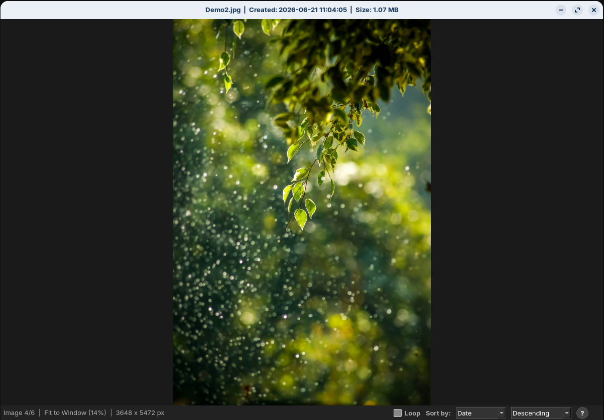
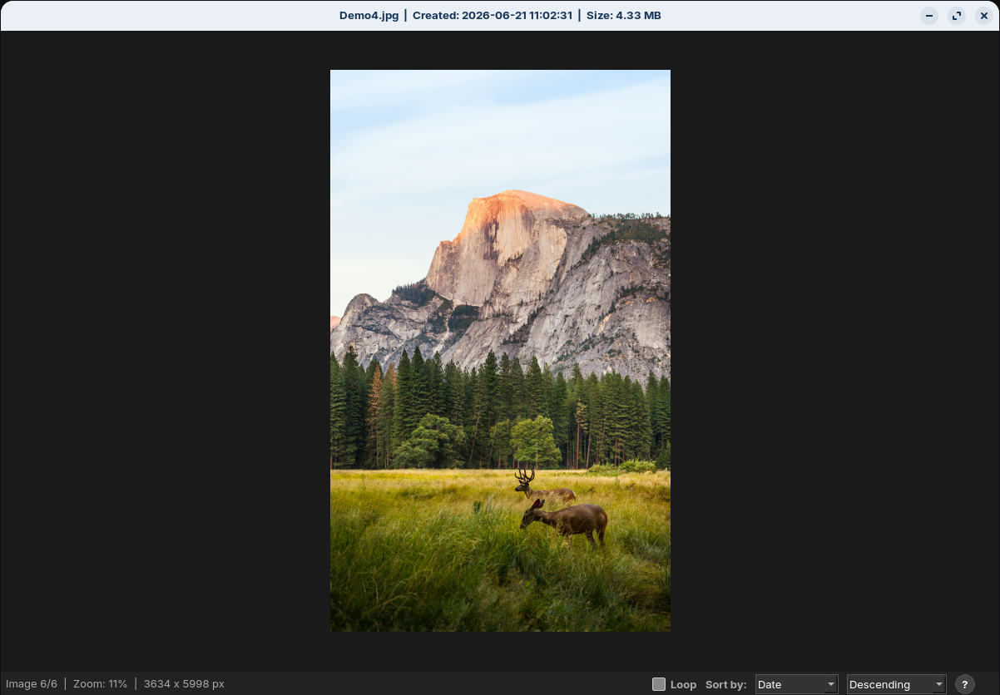
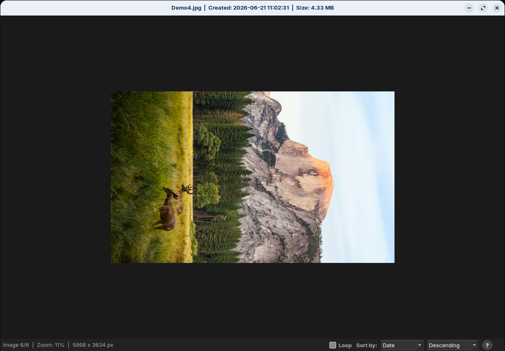
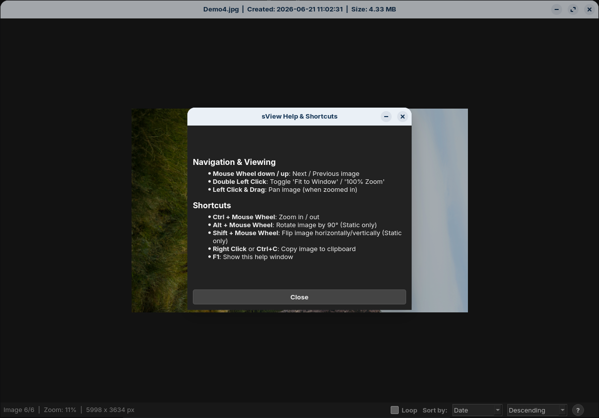

# sView - Minimal Image Viewer

A basic image viewer written in Python and PyQt6. It focuses on core functionality: viewing images and applying simple transformations using the Ctrl-/Alt-/Shift-key and the mouse wheel. No overlay-buttons hiding parts of the picture, no deep menus, no extra features inflating code and tool. sView is a very slim, very fast tool with what I consider to be the minimum (and maximum) features necessary for an image viewer. It supports common formats as well as animated formats (.gif, .webp). sView works in read-only mode - except for the sView.ini (to save your preferred sort style and order) the tool can't write any files. Transformations (like rotating or flipping the image) are NOT permanent.

## Features

* **Small footprint:** The standalone script is approximately 23 KB in size.
* **Auto-resize:** Images larger than the window are automatically scaled to fit upon opening.
* **Panning:** Left-click (pressed) + Mouse Movement pans the (zoomed in) picture.
* **Quick resize:** Left double-click toggles between original size and a 'fit to window'-size.
* **Mouse wheel controls:**
  * `Mouse wheel`: Next / Previous image
  * `Ctrl + Mouse wheel`: Zoom (using the cursor position as the focal point)
  * `Alt + Mouse wheel`: Rotate image by 90° (Mousewheel up = rotate ccw / Mousewheel down = rotate cw)
  * `Shift + Mouse wheel`: Flip image (Mousewheel up = vertical / Mousewheel down = horizontal)
* **Drag & Drop:** Open images by dragging them into the viewer window.
* **Clipboard integration:** Copy the current image state (including applied rotation and flips) via `Right-click` or `Ctrl+C`.
* **Animated image support:** Basic support for viewing and zooming animated formats like GIF and WebP.
* **Sort Style / Order:** Change to your liking in the two menus bottom-right. sView saves your preferences in the sView.ini.

## Screenshots

See below for a preview of the viewer in action, demonstrating its core functionality:

| Standard View | Scaled Image |
| :--- | :--- |
|  |  |
| *Standard view of an image* | *Image display scaled down* |

| Rotated Image | Help Overlay |
| :--- | :--- |
|  |  |
| *Image displayed in rotated state* | *Viewing the integrated help text* |

## Dependencies

sView relies on your system's native libraries. You will need Python 3 and PyQt6.

On Debian/Ubuntu-based distributions (e.g., Zorin OS, Linux Mint), you can install the requirements via terminal:

```bash
sudo apt update
sudo apt install python3-pyqt6
```

> **Note:** For extended format support, such as TIFF, WebP, or HEIC, ensure that system packages like `qt6-image-formats` are installed.

## Installation

To install sView system-wide and make it available in your application menu, open a terminal in the project directory and run the following commands.

1. **Make the script executable:**
   ```bash
   chmod +x sView.py
   ```

2. **Copy the script to your local binaries:**
   ```bash
   sudo cp sView.py /usr/local/bin/sview
   ```

3. **Install the desktop entry:**
   ```bash
   sudo cp sView.desktop /usr/share/applications/
   ```

Afterward, you can launch sView from your application menu or set it as the default image viewer in your file manager. Double-clicking a supported image automatically starts the tool.

## License

This project is licensed under the GNU GPLv3. You are free to use, modify, and distribute the code. Please refer to the `LICENSE` file for more details.
